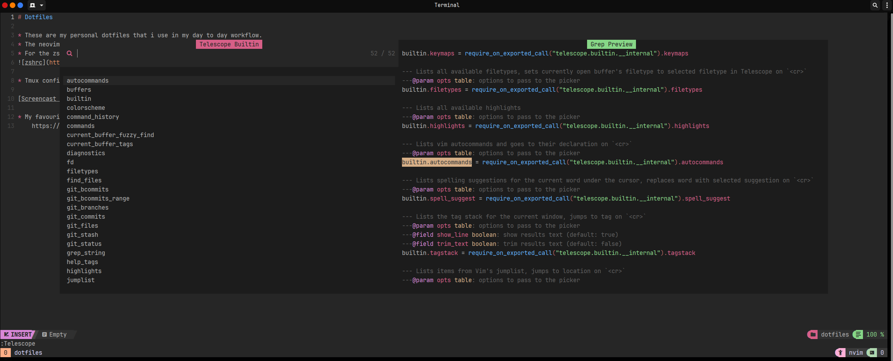
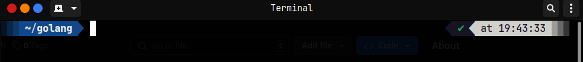

# Dotfiles

* These are my personal dotfiles that i use in my day to day workflow.
* The neovim config in the repo is basically default nvChad flavour of neovim.

* For the zshrc I am using a default zsh with a few plugins and powerlevel10k theme to just fancy up my shell mostly.

* Tmux config is to set a few bindkeys and Dracula theme.

[Screencast from 2024-08-31 19-21-30.webm](https://github.com/user-attachments/assets/9d7a9d13-3964-4e59-af63-6e6d51d1ad96)

* My favourite shell fonts:
    https://www.jetbrains.com/lp/mono/
